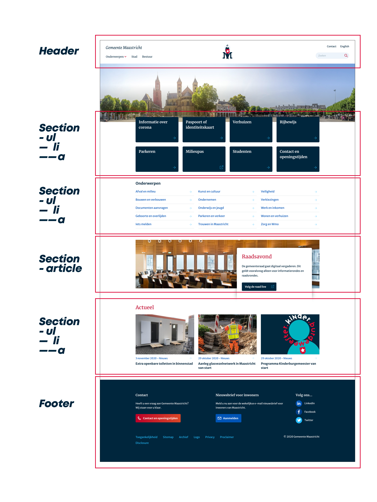

# Procesverslag
**Auteur:** Sander Noija

Markdown cheat cheet: [Hulp bij het schrijven van Markdown](https://github.com/adam-p/markdown-here/wiki/Markdown-Cheatsheet). Nb. de standaardstructuur en de spartaanse opmaak zijn helemaal prima. Het gaat om de inhoud van je procesverslag. Besteedt de tijd voor pracht en praal aan je website.

## Eindgesprek (week 7/8)

> Al met al ging het mij vrij makkelijk af. Ik merk dat ik met sommige dingen wat gemakzuchtig ben.
> Met het eindresultaat ben ik tevreden. De uitdaging zat mij ook niet zozeer in het coderen/programmeren van de website.
> Het uitwerken van de micro interactie met JS had wat uitgebreider gemogen. Resultaat van nu vind ik vrij basic.

**Screenshot(s):**

(images/widescreen.png)
(images/smallerscreen.png)

## Voortgang 3 (week 6)

> Ik heb een tijd stil gezeten. Niet veel aan de website gewerkt waardoor ik nog een tweede pagina miste en javascript.
> Vasilis gaf als feedback dat ik goed naar het beoordelingsformulier moest gaan kijken. Doe wat nodig is en vink alles af.
> Ook nu was ik goed opweg, ondanks dat ik in de tussentijd niet onwijs veel vordering had gemaakt.
> Pagina bevat kleine css animatie's en er is genoeg gebruik gemaakt van verschillende html elementen.

## Voortgang 2 (week 5)

> Ziek --> geen voortgangsgesprek gehad/

## Voortgang 1 (week 3)

### Stand van zaken

> Ik ben aardig op weg. Groot gedeelte van de homepagina is klaar. 
> De pagina bestaat voor een groot deel uit "ul" & "li's".

> Tijdens het feedback moment kreeg ik van de student assistenten te horen dat ik goed op weg ben.

## Intake (week 1)

**Je startniveau:** -kies uit zwart, rood óf blauw-
> Rood

**Je focus:** -kies uit responsive óf surface plane-
> Surface plane

**Je opdracht:** -link naar de website die je gaat namaken óf de naam van je eigen ontwerp-
> https://www.gemeentemaastricht.nl/

**Breakdown-schets(en):**

